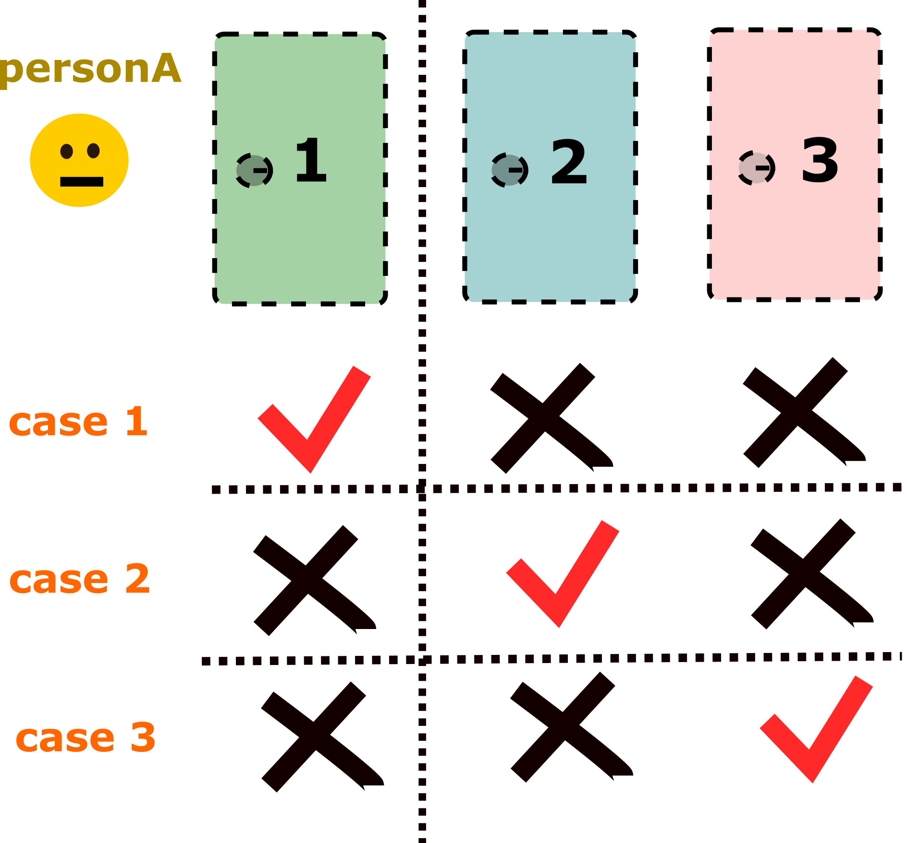

<p align="center">
  <h1 align="center">Monty Hall Problem</h1>
  <h3 align="center">Xue Xiao</h3>
  <div align="center">
        
  </div>
  
## The problem
In the classic game, there are three doors—only one of them hides a prize, while the other two are empty. You choose a door at random, say door #1. Then, a bystander opens one of the remaining two doors (say door #2), revealing it to be empty. Now you're faced with a choice: should you switch to the remaining unopened door (#3), or stay with your original choice?

Many people claim that switching increases your chances of winning, based on a well-known argument: since you initially have a 1/3 chance of choosing the prize, the remaining two doors collectively hold a 2/3 chance. When one of those is revealed to be empty, they argue, the full 2/3 probability "transfers" to the remaining closed door, making switching the better strategy.

However, this reasoning subtly changes the problem. The real question is: given that the bystander opens an empty door and you are presented with a switching option, should you switch? In other words, we must only consider the situations where the bystander opens an empty door and leaves exactly one unopened alternative—a true switching scenario. If the bystander had opened the prize door, the game would end immediately with no switching choice available.

So, to correctly calculate the probability, you must focus on the subset of cases where you actually face a switching decision. The denominator of your probability should be the total number of times such switching situations arise. Then, among those, you compare how often sticking vs. switching leads to a win.

Let’s revisit the original 3-door example. While case 1 (you pick the prize door initially) has a 1/3 chance, and cases 2 and 3 (you pick an empty door) together have a 2/3 chance, not all cases equally lead to switching scenarios. In case 1, no matter which of the two remaining doors the bystander opens, you always face a switching decision, which means 100% chance of facing a switching situation. In cases 2 and 3, however, the bystander must choose specifically the empty door that doesn’t contain the prize, or else the prize is revealed and no switching scenario occurs. So each of those has only a 50% chance of leading to a switching situation.

Thus, if you're only counting the times you are truly faced with a switching decision, the background distribution changes. You are no longer sampling uniformly from all three cases, but rather conditioning on only the ones that present a switching scenario. And in that conditional space, the probability of winning by switching becomes equal to that of not switching. This is because, although case 1 has a lower chance of being sampled, it always counts as a switching situation. In contrast, cases 2 and 3 are each only counted as switching situations 50% of the time.

To illustrate this, here is a Python simulation. You can run it with --times to set how many simulations to perform, and --n to set how many doors to include. The rules generalize to more than three doors: you pick one, the bystander opens all but one of the remaining doors (only opening empty ones), and a switching situation is only considered valid if the prize was not revealed during the process. You'll find that, when conditioned on the actual switching scenarios, the probabilities of winning by switching or staying are roughly equal.

## Run the code
```bash
python monty_simulation.py --n 3 --times 1000000
```
</p>


## Requirements
To run the code you have to install python and its numpy library.

## License
The code related to the DiffMorpher algorithm is licensed under [LICENSE](LICENSE). 
